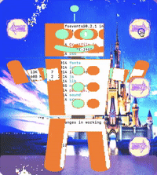

# avava-builder

I founded Avava Toys in collaboration with Heidi Hillenbrand, Tony Oberto,
Danny Tran, Alex Kehr, Alex Mohr, and Martiniano Sanchez in 2014.

The avava-builder application enables children (of all ages) to invent a custom
creature pieced together from an array of body parts.  Once the toy was built
in avava-builder, it could be exported to a 3D printer and brought into the
physical world.

The avava-builder application is no longer supported, and the Avava Toys brand
has since dissolved.
